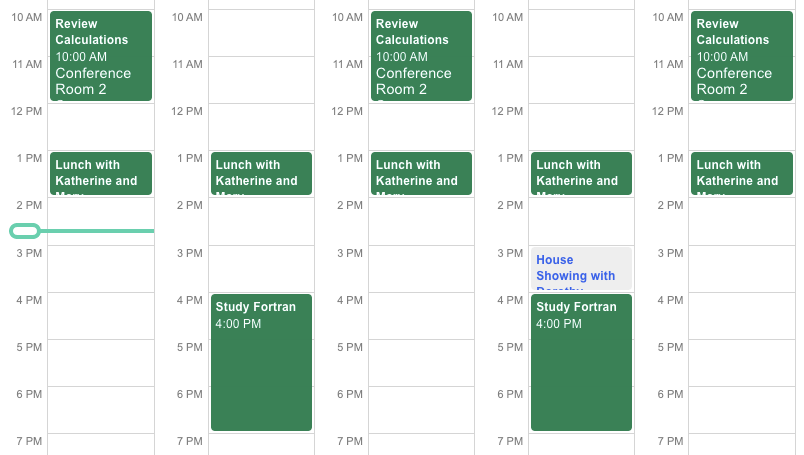

# Nylas Agenda

Nylas Agenda (`<nylas-agenda>`) is part of the Nylas Components library that lets you build user-facing calendar applications in minutes. Use Nylas Agenda with your Nylas account or by passing in your own JSON data.



## Table of Contents

- [Nylas Agenda](#nylas-agenda)
  - [Table of Contents](#table-of-contents)
  - [Installation](#installation)
  - [Using It in Your App](#using-it-in-your-app)
    - [Fetching data directly from Nylas](#fetching-data-directly-from-nylas)
      - [Setup](#setup)
      - [Allowed domains](#allowed-domains)
    - [Passing in your own data](#passing-in-your-own-data)
    - [Properties](#properties)
    - [Events and Callbacks](#events-and-callbacks)
  - [Contributing](#contributing)
    - [Testing](#testing)
  - [Additional Documentation](#additional-documentation)

## Installation

In your JavaScript application, you can install Nylas Agenda with:

- npm `npm i @nylas/components-agenda`
- Yarn `yarn add npm i @nylas/components-agenda`

Alternatively, on an html page, you can load the Agenda using a script tag:

```
   <head>
      <!-- Import the script from CDN -->
      <script src="https://unpkg.com/@nylas/components-agenda"></script>
    </head>
```

For both installation options, in the body of your page, you can instantiate the agenda with `<nylas-agenda></nylas-agenda>`.

## Using It in Your App

All Nylas components have two ways of dislaying data to your end-user:

1. [Fetching data directly from Nylas](#fetching-data-directly-from-nylas)
2. [Passing in your own data](#passing-in-your-own-data)

### Fetching data directly from Nylas

#### Setup

If you haven't registered for a Nylas account yet, you can do so at dashboard.nylas.com. Once there, head to the **Components** tab and create a new Agenda component.

You'll be guided through the component setup and be given the option to tie your component to your calendar account. Review the [Agenda Documentation](https://developer.nylas.com/docs/user-experience/components/agenda-component/).

#### Allowed domains

During the setup process, you'll be prompted to provide a list of [allowed domains](https://developer.nylas.com/docs/user-experience/components/agenda-component/#allowed-domains). Be sure to add any domains you'll be testing your app on, including `localhost`, and any staging and production URLs you might use.

### Passing in your own data

Nylas Agenda can be used as a UI on top of any event data that you provide. Events should follow the [Nylas events object standard](https://developer.nylas.com/docs/api/#tag--Events--events-object).

> :bell:
>
> Events `when` Subobject
>
> Make sure to review the events `when` subobject since that determines where your Agenda events will appear.

The property to use for this is `events`. You can pass in an JSON array of events.

```json
  const staticEvents = [
    {
      "title": "Some event that I am manipulating outside of the context of Nylas",
      "description": "Passed in from HTML!",
      "participants": [],
      "when": { "end_time": 1600444800, "object": "timespan", "start_time": 1600438500 }
    },
    {
      "title": "Some I got from elsewhere",
      "description": "Passed in from HTML!",
      "participants": [],
      "when": { "end_time": 1600449999, "object": "timespan", "start_time": 1600448500 }
    }
  ]
```

Then pass the array into your component using any JavaScript.

```js
<nylas-agenda events={events}>
```

You can also use plain JavaScript as an attribute.

```js
document.querySelector("nylas-agenda").events = staticEvents;
```

### Properties

Nylas Agenda allows for several properties that affect the layout and functionality of your component. You can find a complete list of properties within our [Documentation for Nylas Agenda](https://developer.nylas.com/docs/user-experience/components/agenda-component/#application-component-display-options)

### Events and Callbacks

You can listen to certain user events from your application by adding an event listener to your component.

For example, you can listen for a `dateChange` event with the following code:

```js
document
  .querySelector("nylas-agenda")
  .addEventListener("dateChange", (event) => {
    let { detail } = event;
    console.log("date changed", detail);
  });
```

A list of emitted events is available on our [Documentation for Nylas Agenda](https://developer.nylas.com/docs/user-experience/components/agenda-component/#custom-callbacks)

## Contributing

Please refer to our [Contributing Guidelines](CONTRIBUTING.md) for information about how to get involved. We welcome bug reports, questions, and pull requests.

1. Git clone `git@github.com:nylas/components.git`
2. Run `yarn install`
3. Run `yarn start`; your browser will load `http://localhost:8000` and show you a list of available running components

### Testing

`yarn cy:open` will launch our end-to-end tests in a browser
tests will automatically be run on push from push.yaml
snapshot (visual) diff tests are fun using Percy by running `yarn snapshot`

## Additional Documentation

- [Nylas Agenda on NPM](https://www.npmjs.com/package/@nylas/components-agenda)
- [Nylas Docs: Agenda Component](https://developer.nylas.com/docs/user-experience/components/agenda-component/)
