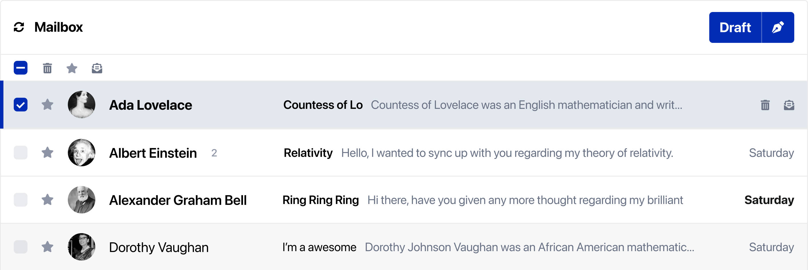

# Nylas Mailbox

Nylas Mailbox (`<nylas-mailbox>`) is part of the Nylas Components library that lets you build email/mailbox applications in minutes. Use Nylas Mailbox with your Nylas account or by passing in your own JSON data.

Nylas Mailbox is currently in active development. Want to contribute? [Find out how!](../../CONTRIBUTING.md)



## Table of Contents

- [Nylas Mailbox](#nylas-mailbox)
  - [Table of Contents](#table-of-contents)
  - [Installation](#installation)
  - [Using It in Your App](#using-it-in-your-app)
    - [Fetching data directly from Nylas](#fetching-data-directly-from-nylas)
      - [Setup](#setup)
      - [Allowed domains](#allowed-domains)
    - [Passing in your own data](#passing-in-your-own-data)
    - [Properties](#properties)
    - [Events and Callbacks](#events-and-callbacks)
  - [Contributing](#contributing)
    - [Testing](#testing)
  - [Additional Documentation](#additional-documentation)

## Installation

In your JavaScript application, you can install Nylas Mailbox with:

- npm `npm i @nylas/components-mailbox`
- Yarn `yarn add @nylas/components-mailbox`

Alternatively, on an html page, you can load the Mailbox using a script tag:

```
   <head>
      <!-- Import the script from CDN -->
      <script src="https://unpkg.com/@nylas/components-mailbox"></script>
    </head>
```

For both installation options, in the body of your page, you can instantiate the mailbox component with `<nylas-mailbox></nylas-mailbox>`.

## Using It in Your App

All Nylas components have two ways of displaying data to your end-user:

1. [Fetching data directly from Nylas](#fetching-data-directly-from-nylas)
2. [Passing in your own data](#passing-in-your-own-data)

### Fetching data directly from Nylas

#### Setup

If you haven't registered for a Nylas account yet, you can do so at dashboard.nylas.com. Once there, head to the **Components** tab and create a new Mailbox component.

You'll be guided through the component setup and be given the options to customize your mailbox component. Review the [Mailbox Documentation](https://developer.nylas.com/docs/user-experience/components/mailbox-component/).

#### Allowed domains

During the setup process, you'll be prompted to provide a list of [allowed domains](https://developer.nylas.com/docs/user-experience/components/mailbox-component/#allowed-domains). Be sure to add any domains you'll be testing your app on, including `localhost`, and any staging and production URLs you might use.

### Passing in your own data

Nylas Mailbox can be used as a UI on top of any threads data that you provide. Threads should follow the [Nylas thread object standard](https://developer.nylas.com/docs/api/#tag--Threads).

The property to use for this is `all_threads`. You can pass in a JSON array of threads.

```json
  const staticThreads = [
    {
      "account_id":"adsghdgajhsgdikzvz9afb",
      "drafts":[],
      "first_message_timestamp":1621472861,
      "has_attachments":false,
      "id":"daskjdkahskjdhk7md84fgk",
      "labels":[{"display_name":"Inbox","id":"asdghsdfafasdfdsfcm4","name":"inbox"}],
      "last_message_received_timestamp":1621472865,
      "last_message_sent_timestamp":null,
      "last_message_timestamp":1621472865,
      "messages":[
        {
          "account_id":"adsghdgajhsgdikzvz9afb",
          "bcc":[],
          "cc":[
            {"email":"phil.r@nylas.com","name":"Phil Renaud"},
            {"email":"review_requested@noreply.github.com","name":"Review requested"}
          ],
          "date":1621472861,
          "files":[],
          "from":[
            {"email":"notifications@github.com","name":"Mostafa Rashed"}
          ],
          "id":"epgdadhsgfdghasyy6h9yyle6v",
          "labels":[
            {"display_name":"Inbox","id":"3fhdx7ssdfsfsdfm5ecwcm4","name":"inbox"}
          ],
          "object":"message",
          "reply_to":[
            {"email":"abcd@reply.github.com","name":"nylas/nylas-nodejs"}
          ],
          "snippet":"Hi, Welcome to Nylas",
          "starred":false,
          "subject":"Hello from Nylas",
          "thread_id":"ddfgdfdgdjsgdjhas7md84fgk",
          "to":[
            {"email":"nylas-nodejs@noreply.github.com","name":"nylas/nylas-nodejs"}
          ],
          "unread":true
        },
        {}
      ],
      "snippet":"Hi, Welcome to Nylas",
      "starred":false,
      "subject":"Hello from Nylas",
      "unread":true,
      "version":1
    },
    {
    }
  ]
```

Then pass the array into your component using any JavaScript.

```js
<nylas-mailbox all_threads={staticThreads}>
```

You can also use plain JavaScript as an attribute.

```js
document.querySelector("nylas-mailbox").all_threads = staticThreads;
```

### Properties

Nylas Mailbox allows for several properties that affect the layout and functionality of your component. You can find a complete list of properties within our [Documentation for Nylas Mailbox](https://developer.nylas.com/docs/user-experience/components/mailbox-component/#mailbox-properties)

### Events and Callbacks

You can listen to certain user events from your application by adding an event listener to your component.

For example, you can listen for a `threadClicked` event with the following code:

```js
document
  .querySelector("nylas-mailbox")
  .addEventListener("onStarSelected", (event) => {
    let { detail } = event;
    console.log("star selected: ", detail);
  });
```

A list of emitted events is available on our [Documentation for Nylas Mailbox](https://developer.nylas.com/docs/user-experience/components/mailbox-component/#event-listeners)

## Contributing

Please refer to our [Contributing Guidelines](CONTRIBUTING.md) for information about how to get involved. We welcome bug reports, questions, and pull requests.

1. Git clone `git@github.com:nylas/components.git`
2. Run `yarn install`
3. Run `yarn start`; your browser will load `http://localhost:8000` and show you a list of available running components

### Testing

`yarn cy:open` will launch our end-to-end tests in a browser
tests will automatically be run on push from push.yaml

## Additional Documentation

- [Nylas Mailbox on NPM](https://www.npmjs.com/package/@nylas/components-mailbox)
- [Allowed query parameters](https://developer.nylas.com/docs/api/#get/threads)
- [Threads search endpoint](https://developer.nylas.com/docs/api/#get/threads/search)
- [Nylas Docs: Mailbox Component](https://developer.nylas.com/docs/user-experience/components/mailbox-component/)
